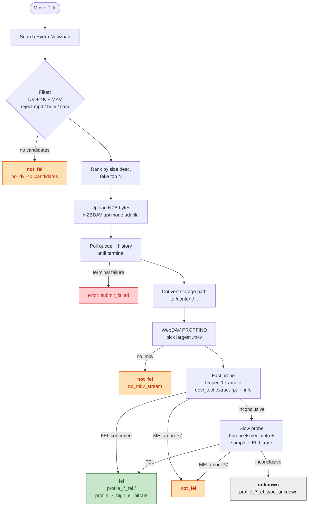

# find-fel-nzbdav

Identify whether a movie title has a **Dolby Vision Profile 7 FEL** MKV reachable through your NZBHydra2 + NZBDAV stack — without downloading the file first.

The tool searches Hydra, picks the most promising 4K Dolby Vision MKV candidates, streams them through NZBDAV's WebDAV, and probes the live stream with `ffmpeg` + `dovi_tool` to decide: is this a Full Enhancement Layer release or not?

---

## Why FEL?

Dolby Vision releases come in several profiles. Profile 7 is the one shipped on UHD Blu-ray, and it splits into two flavors:

| Variant | Enhancement Layer | What you get |
|---|---|---|
| **FEL** (Full) | Lossless | The complete Dolby Vision metadata + lossless EL — true Blu-ray-grade DV |
| **MEL** (Minimal) | Minimal | DV metadata only, no real EL — visually closer to Profile 8 |

If you care about owning Blu-ray-grade DV remuxes, **FEL is the only thing that matters**. This tool answers the "do I even have a FEL release available?" question in seconds per title, without committing to a full import.

---

## How it works



The probe is staged on purpose: a Profile 7 (FEL) release can usually be confirmed from a single keyframe + RPU summary in a few seconds. Only when the fast path is inconclusive does the tool fall back to sampling several seconds of stream and measuring enhancement-layer bitrate.

---

## Requirements

- **Python 3.11+** (the launcher works on 3.14; see [the wrapper note](#the-wrapper-script) below)
- **[uv](https://github.com/astral-sh/uv)** for env management
- A reachable **[NZBHydra2](https://github.com/theotherp/nzbhydra2)** instance with an API key
- A reachable **[NZBDAV](https://github.com/nzbdav-dev/nzbdav)** instance with the SABnzbd-compatible API enabled
- Local CLI tools on `PATH`:
  - `ffmpeg`
  - `ffprobe`
  - `mediainfo`
  - `dovi_tool` ([quietvoid/dovi_tool](https://github.com/quietvoid/dovi_tool))

```bash
# macOS via Homebrew
brew install ffmpeg mediainfo dovi_tool
```

---

## Setup

```bash
git clone <repo-url> find-fel-nzbdav
cd find-fel-nzbdav
uv sync
chmod +x find-fel-nzbdav
```

Create a `.env` in the project root:

```sh
# required
NZB_DAV_URL=http://your-nzbdav:3000
NZB_DAV_API_KEY=...
HYDRA_URL=http://your-hydra:5076
HYDRA_API_KEY=...

# optional
WEBDAV_URL=http://your-nzbdav:3000        # defaults to NZB_DAV_URL
WEBDAV_USER=
WEBDAV_PASS=
FEL_MAX_CANDIDATES=3                       # how many releases to try per title
FEL_POLL_INTERVAL=5                        # seconds between NZBDAV status checks
FEL_TIMEOUT=1800                           # seconds before giving up on a job
```

`.env` is gitignored — your API keys stay local.

---

## Usage

### Single title

```bash
./find-fel-nzbdav "Creepshow"
./find-fel-nzbdav --json "The Deer Hunter"
```

### Batch from a text file

One title per line. Blank lines and `#` comments are skipped:

```bash
./find-fel-nzbdav --titles-file my_movies.txt
./find-fel-nzbdav --json --titles-file my_movies.txt > results.ndjson
```

In `--json` mode the batch output is **NDJSON** — one JSON object per line, flushed after every title so you can `tail -f` mid-run.

### Other flags

| Flag | Description | Default |
|---|---|---|
| `--titles-file PATH` | Read titles from a file (one per line) | — |
| `--json` | Emit machine-readable JSON / NDJSON | text |
| `--log-file PATH` | Override the log file path | `./logs/find-fel-<timestamp>.log` |
| `--env PATH` | Custom `.env` location | `.env` |
| `--max-candidates N` | Releases to try per title | `3` |
| `--probe-seconds N` | Sample length for the slow probe fallback | `10` |
| `--timeout SECONDS` | NZBDAV job timeout | `1800` |
| `--poll-interval SECONDS` | NZBDAV poll cadence | `5` |

---

## Output

### Text mode

```
Creepshow: fel (profile_7_fel)
- fel: Creepshow 1982 2160p UHD BluRay REMUX DV HEVC Atmos [profile_7_fel]
```

### JSON mode

Compact NDJSON; one object per title:

```json
{"title": "Creepshow", "verdict": "fel", "reason": "profile_7_fel", "candidates": [...]}
```

Each candidate object includes the release title, redacted link, size, indexer, status, reason, NZBDAV job id, WebDAV path, redacted stream URL, and a probe summary.

**Secrets are redacted everywhere**: API keys in URLs, basic-auth credentials, and `-headers` values in `ffmpeg`/`ffprobe` commands — including nested URLs inside query parameters.

---

## Verdicts & exit codes

| Verdict | Meaning | Exit code |
|---|---|---|
| `fel` | Profile 7 FEL confirmed | `0` |
| `not_fel` | No DV/4K candidates, only MEL, non-Profile-7, or no MKV stream | `0` |
| `unknown` | Probe inconclusive or infrastructure failure | `2` |

For batch runs, the aggregate exit code is `0` if *any* title got a definitive verdict, `2` if every title was indeterminate.

---

## Logging

Every run writes per-title verdicts to a log file:

```
[2026-05-22T23:48:50] Creepshow: fel (profile_7_fel)
[2026-05-22T23:51:13] The Deer Hunter: not_fel (no_mkv_stream)
[2026-05-22T23:54:02] Despicable Me 4: unknown (profile_7_el_type_unknown)
```

- Default path: `./logs/find-fel-<YYYYMMDD-HHMMSS>.log`
- Override with `--log-file PATH`
- Append mode with flush-per-title, so Ctrl-C preserves partial progress
- `logs/` is gitignored

---

## The wrapper script

The launcher you invoke (`./find-fel-nzbdav`) is a one-line shell wrapper:

```sh
exec uv run python "$(dirname "$0")/src/cli.py" "$@"
```

**Why a wrapper instead of just `uv run find-fel-nzbdav`?** Because of a real interop issue:

1. uv (0.11.x) sets macOS `UF_HIDDEN` on the `.pth` files it manages inside the venv.
2. Python 3.14 silently skips `.pth` files marked hidden (anti-`.pth`-injection security check).
3. Editable installs depend on that `.pth` to put `src/` on `sys.path` — so the installed console script fails with `ModuleNotFoundError: No module named 'cli'`.

The wrapper bypasses the whole pipeline by invoking `python src/cli.py` directly, which uses Python's built-in script-mode rule of putting the script's directory on `sys.path[0]`. No editable install, no `.pth`, no chflags whack-a-mole.

If you'd rather not use the wrapper:
- Upgrade uv (newer versions may have stopped hiding `.pth` files).
- Or pin Python to `>=3.11,<3.14` in `pyproject.toml`.
- Or run `uv run python src/cli.py ...` directly — same effect, longer command.

---

## Testing

```bash
uv run pytest -q
```

Tests run with pure fakes — no network, no subprocess. The test suite covers all modules and the end-to-end workflow orchestration.

---

## Project layout

```
src/
  cli.py          # argparse, batch loop, NDJSON / text / log writers
  config.py       # .env parsing, URL normalization
  httpclient.py   # urllib wrapper + URL redaction
  hydra.py        # Newznab XML parsing, DV/4K/MKV filter
  nzbdav.py       # SAB-compatible client, queue/history polling, storage→/content/
  webdav.py       # PROPFIND, largest-MKV selection
  probe.py        # ffmpeg/dovi_tool/mediainfo runner, FEL classification
  workflow.py     # check_title orchestration
  models.py       # Candidate, CandidateResult, TitleResult, verdict constants
tests/            # mirrors src/, pure-fake unit tests
```
